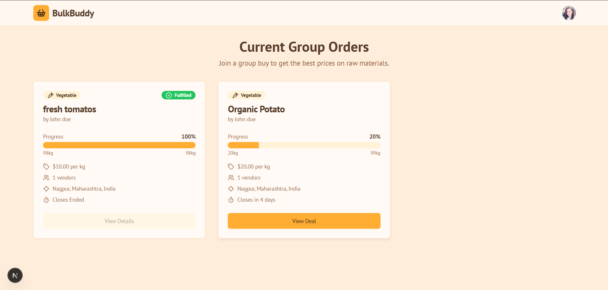

# BulkBuddy: Collaborative Group Buying Platform

BulkBuddy is a web application designed to connect raw material suppliers with street vendors and restaurants. It allows suppliers to list products for bulk purchase, and vendors to join together to meet minimum order quantities, unlocking better prices and reducing waste.


*A placeholder image of the application interface.*

## ✨ Features

-   **Dual User Roles**: Separate signup and functionality for **Suppliers** and **Vendors**.
-   **Supplier Dashboard**: Suppliers can create, manage, and track their product listings.
-   **Vendor Marketplace**: Vendors can browse group orders, view progress, and contribute to join a purchase.
-   **Real-time Order Progress**: Live tracking of how close a group order is to meeting its minimum quantity.
-   **Firebase Integration**:
    -   **Authentication**: Secure user signup and login.
    -   **Firestore**: Persistent storage for user profiles and product data.
-   **Responsive Design**: A clean, modern UI that works on all devices.

## 💻 Tech Stack

-   **Framework**: [Next.js](https://nextjs.org/) (App Router)
-   **Language**: [TypeScript](https://www.typescriptlang.org/)
-   **Styling**: [Tailwind CSS](https://tailwindcss.com/)
-   **UI Components**: [ShadCN UI](https://ui.shadcn.com/)
-   **Backend & Database**: [Firebase](https://firebase.google.com/) (Authentication & Firestore)
-   **Form Management**: [React Hook Form](https://react-hook-form.com/) & [Zod](https://zod.dev/) for validation

## 🚀 Getting Started

Follow these instructions to set up and run the project on your local machine.

### Prerequisites

-   [Node.js](https://nodejs.org/) (v18 or later)
-   [npm](https://www.npmjs.com/) or [yarn](https://yarnpkg.com/)
-   A Firebase project. If you don't have one, create one at the [Firebase Console](https://console.firebase.google.com/).

### 1. Clone the Repository

```bash
git clone <your-repository-url>
cd bulkbuddy
```

### 2. Install Dependencies

```bash
npm install
# or
yarn install
```

### 3. Configure Firebase

The application is already configured to connect to a Firebase project. The connection details are in `src/lib/firebase.ts`.

If you need to connect to a different Firebase project, follow these steps:

1.  In the Firebase Console, go to your project's **Project Settings**.
2.  Under the "Your apps" card, select the "Web" platform (`</>`).
3.  Copy the `firebaseConfig` object.
4.  Paste this object into `src/lib/firebase.ts`, replacing the existing configuration.

### 4. Set up Firebase Services

In the [Firebase Console](https://console.firebase.google.com/) for your project:

1.  **Authentication**:
    -   Navigate to **Authentication** > **Sign-in method**.
    -   Enable the **Email/Password** provider.
2.  **Firestore**:
    -   Navigate to **Firestore Database**.
    -   Click **Create database** and start in **Production mode**.
    -   Choose a location for your database.
    -   Go to the **Rules** tab and paste the content from the `firestore.rules` file in this project to allow read/write access for your app.

### 5. Run the Development Server

```bash
npm run dev
```

Open [http://localhost:9002](http://localhost:9002) in your browser to see the result.

## 📂 Project Structure

```
.
├── src
│   ├── app/                # Next.js App Router pages
│   ├── components/         # Reusable React components (including ShadCN UI)
│   ├── context/            # React Context providers (e.g., AuthContext)
│   ├── hooks/              # Custom React hooks
│   ├── lib/                # Core logic, Firebase config, data access
│   └── ai/                 # Genkit AI flows (if any)
├── public/                 # Static assets
└── tailwind.config.ts      # Tailwind CSS configuration
```

## 🌐 Deployment

This application is configured for deployment on **Firebase App Hosting**. You can deploy it by connecting your repository to a Firebase App Hosting backend in the Firebase console.
